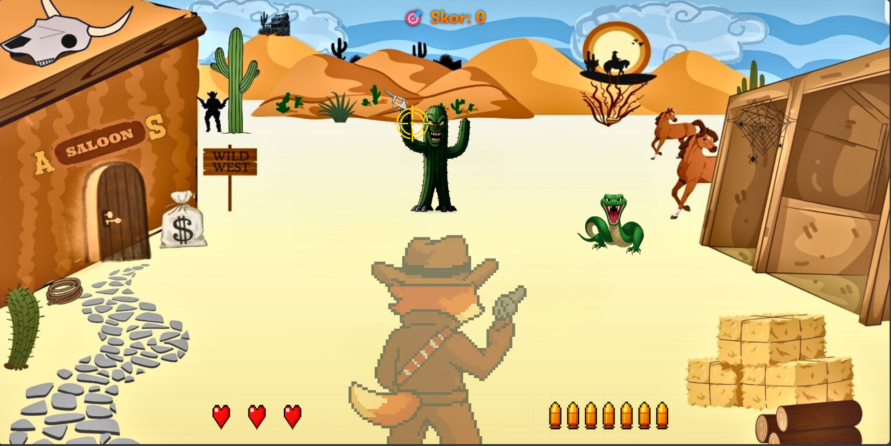
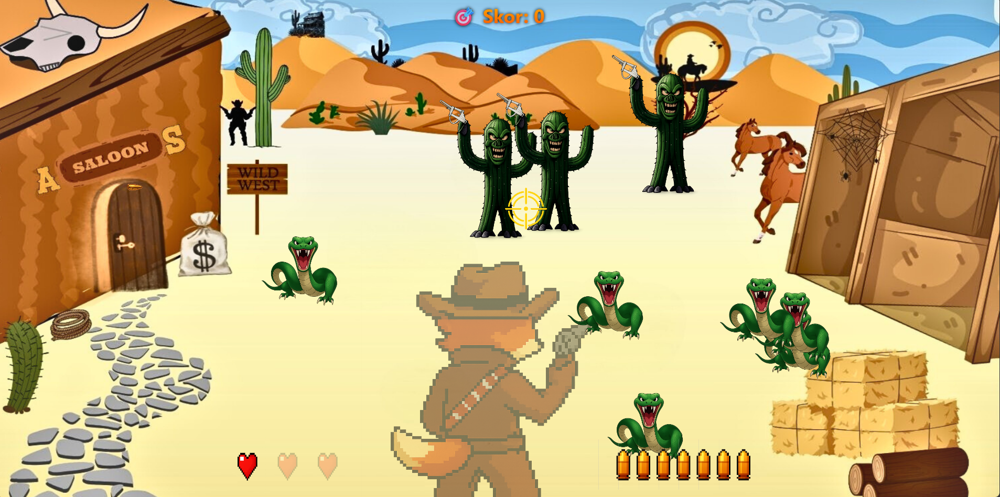

# 🤠 Wild West Rollout

Bu proje, tarayıcı tabanlı bir Wild West temalı atış oyunudur. HTML5 Canvas kullanılarak geliştirilmiştir. Oyunda bir kovboy olarak, kaktüs adamlar ve yılanlarla mücadele ederek en yüksek skoru elde etmeye çalışırsınız.

## 🎮 Oyun Özellikleri

- 🌵 Vahşi batı temalı, etkileyici 2D grafiklere sahip atış oyunu
- 🎯 Hassas nişan alma sistemi ve gerçekçi hedef mekanikleri
- 👾 İki farklı düşman tipi ve benzersiz davranış kalıpları:
  - **Kaktüs Adam**: Sağa sola hareket eder, yakınında durursanız zarar verir
  - **Yılan**: Size doğru ilerler ve durduğu yerde tehlike oluşturur
- 🔫 Dinamik mermi toplama sistemi ve sınırlı cephane yönetimi
- ❤️ 3 canlı can sistemi ve stratejik sağlık yönetimi
- 🏆 Rekabetçi skor sistemi
- 🎵 Western temalı arka plan müziği ve gerçekçi ses efektleri
- 📱 Her ekran boyutuna uyumlu responsive tasarım

## 🎯 Nasıl Oynanır?

### Temel Mekanikler
1. 🖱️ Oyunu başlatmak için ekrana tıklayın
2. 🎯 Fare ile hassas nişan alın ve düşmanları vurmak için tıklayın
3. 🔫 Bonus mermileri toplayarak cephanenizi yenileyin (maksimum 7 mermi)
4. ⚔️ Düşmanlarla Mücadele:
   - **Kaktüs Adamlar**: Ekranda belirli bir alanda sağa-sola hareket ederler
     - Ekranda kaldıkları her 5 saniyede 1 can alırlar
     - Maksimum 5 kaktüs adam aynı anda ekranda olabilir
   - **Yılanlar**: Size doğru süzülüp, yakınınızda dururlar
     - Durduktan sonra her 5 saniyede 1 can alırlar
     - Hızlı hareket ederler, dikkatli olun!
5. ⏸️ P tuşu ile istediğiniz zaman oyunu duraklatabilirsiniz

### Strateji İpuçları
- 🎯 Önce yakınınızdaki düşmanları hedef alın
- 💡 Mermilerinizi dikkatli kullanın
- 🏃‍♂️ Sürekli hareket halinde olan Kaktüs Adamları vurmak daha zordur
- ⚡ Yılanlar durduklarında öncelikli hedefiniz olmalıdır

## 📊 Skor Sistemi

Düşmanları etkisiz hale getirerek puan kazanın:
- 🌵 **Kaktüs Adam**: 20 puan
  - Daha zor hedef
  - Sürekli hareket halinde
  - Daha yüksek tehdit
- 🐍 **Yılan**: 10 puan
  - Kolay hedef
  - Öngörülebilir hareket
  - Daha düşük tehdit

En yüksek skoru elde etmek için stratejinizi düşmanların özelliklerine göre belirleyin!

## 🛠️ Teknik Özellikler

### Temel Teknolojiler
- 🎨 **HTML5 Canvas**: Yüksek performanslı 2D grafik renderingi
- 📜 **Vanilla JavaScript**: Saf JavaScript ile geliştirilmiş oyun motoru
- 📱 **Responsive Tasarım**: Her ekran boyutuna otomatik uyum

### Oyun Sistemi Özellikleri
- 🎵 **Gelişmiş Ses Sistemi**
  - Arka plan müziği yönetimi
  - Efekt sesleri kontrolü
  - Ses geçişleri
- 💥 **Çarpışma Algılama**
  - Hassas hedef tespiti
  - Düşman-oyuncu etkileşimi
- 🎮 **Oyun Mekaniği**
  - Kare-bazlı animasyon sistemi
  - Düşman yapay zekası
  - Puan hesaplama sistemi

## 🎵 Ses ve Görseller

Oyun içinde kullanılan tüm ses ve görsel öğeler `assets` klasöründe bulunmaktadır:
- Arka plan müziği
- Silah sesi
- Karakter görselleri
- Düşman görselleri
- Bonus öğeler

## 🚀 Başlangıç

1. Bu repoyu bilgisayarınıza indirin  
2. `index.html` dosyasını bir web tarayıcısında açın  
3. Oyunu oynamaya başlayın!

👉 **Veya hiç indirmeden doğrudan tarayıcınızda oynamak için [buraya tıklayın](https://guldasahmet.github.io/)**

## ⌨️ Kontroller

- **Fare Hareketi:** Nişan alma
- **Fare Tıklaması:** Ateş etme
- **P Tuşu:** Oyunu duraklatma/devam ettirme

## 🎮 Oynanış Videosu

YouTube üzerinden izlemek için tıklayın:  
[👉 Oynanış Videosunu İzle](https://youtu.be/z8Vy4dZQh8Y)

